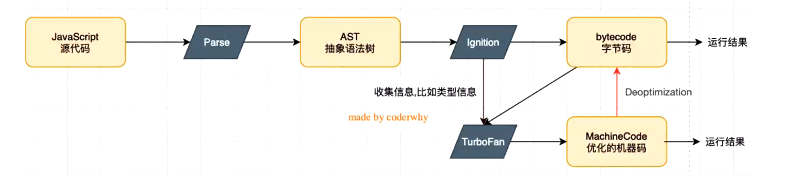

## V8 引擎：

1. V8是用C ++编写的Google开源高性能JavaScript和WebAssembly引擎，它用于Chrome和Nodejs等。
2. 它实现ECMAScript和WebAssembly
3. V8可以独立运行，也可以嵌入到任何C ++应用程序中。

### V8引擎的原理

- V8引擎本身的源码非常复杂，大概有超过100w行C++代码，但是我们可以简单了解一下它执行JavaScript代码的原理

Parse Ignition TurboFan： 内置模块

Parse: source code => AST

Ignition: （解释器） AST => bytecode(类似汇编代码)

TurboFan: 收集信息，比如类型信息 

