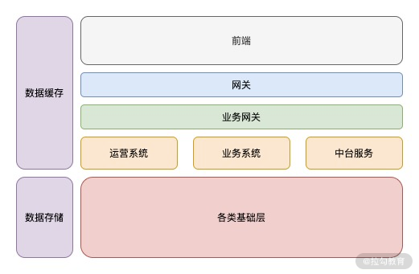
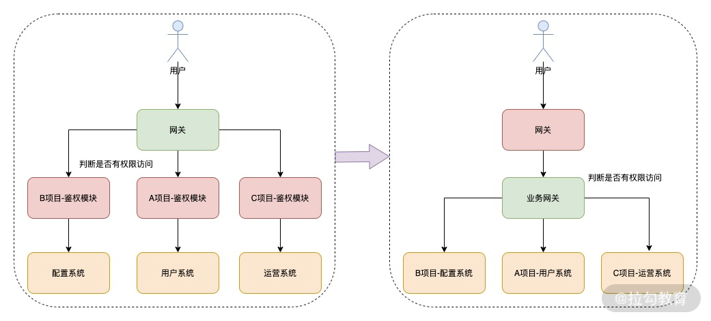

## 应用场景

### 服务分类

网关，处理请求转发和一些通用的逻辑，例如我们常见的 Nginx；

业务网关，处理业务相关的逻辑，比如一些通用的协议转化、通用的鉴权处理，以及其他统一的业务安全处理等；

运营系统，负责我们日常的运营活动或者运营系统；

业务系统，负责我们核心的业务功能的系统；

中台服务，负责一些通用 App 类的服务，比如配置下发、消息系统及用户反馈系统等；

各类基础层，这些就是比较单一的核心后台服务，例如用户模块，这就需要根据不同业务设计不同的核心底层服务；

左侧的数据缓存和数据存储，则是相应的数据类的服务。

网络 I/O 较多，但是 CPU 计算较少、业务复杂度高的服务 => Node.js 应用在业务网关、中台服务及运营系统几个方面

#### 业务网关

Nginx 作为负载均衡转发层，负责负载分发，那么业务网关又是什么呢？

我们后台管理系统有鉴权模块，以往都是在管理后台服务中增加一个鉴权的类，然后在统一路由处增加鉴权判断，而现在不仅仅是这个管理系统需要使用这个鉴权类，多个管理系统都需要这个鉴权类，这时你会考虑复制这个类到其他项目，又或者设计一个专门的服务来做鉴权。

#### 中台服务

#### 运营系统