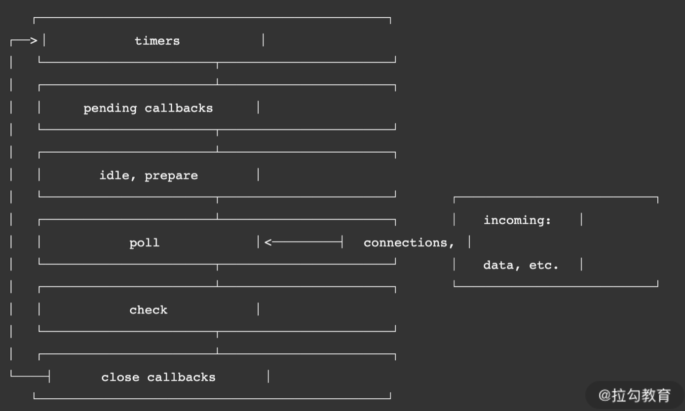

# Node.js 事件循环

事件循环通俗来说就是一个无限的 while 循环。

Questions:

1. 谁来启动这个循环过程，循环条件是什么？
2. 循环的是什么任务呢？
3. 循环的任务是否存在优先级概念？
4. 什么进程或者线程来执行这个循环？
5. 无限循环有没有终点？

## 原理



1. timers

   1. 本阶段执行已经被 setTimeout() 和 setInterval() 调度的回调函数，简单理解就是由这两个函数启动的回调函数。

2. pending callbacks

   1. 本阶段执行某些系统操作（如 TCP 错误类型）的回调函数。

3. idle、prepare

4. poll

   1. 检索新的 I/O 事件，执行与 I/O 相关的回调
   2. 其他情况 Node.js 将在适当的时候在此阻塞。所有的事件循环以及回调处理都在这个阶段执行。

5. check

   1. setImmediate() 回调函数在这里执行，setImmediate 并不是立马执行，而是当事件循环 poll 中没有新的事件处理时就执行该部分

   2. ```javascript
      const fs = require('fs');
      setTimeout(() => { // 新的事件循环的起点
          console.log('1'); 
      }, 0);
      setImmediate( () => {
          console.log('setImmediate 1');
      });
      /// 将会在 poll 阶段执行
      fs.readFile('./test.conf', {encoding: 'utf-8'}, (err, data) => {
          if (err) throw err;
          console.log('read file success');
      });
      /// 该部分将会在首次事件循环中执行
      Promise.resolve().then(()=>{
          console.log('poll callback');
      });
      // 首次事件循环执行
      console.log('2');
      ```

   3. 在这一代码中有一个非常奇特的地方，就是 setImmediate 会在 setTimeout 之后输出。有以下几点原因：

      1. setTimeout 如果不设置时间或者设置时间为 0，则会默认为 1ms；
      2. 主流程执行完成后，超过 1ms 时，会将 setTimeout 回调函数逻辑插入到待执行回调函数poll 队列中
      3. 由于当前 poll 队列中存在可执行回调函数，因此需要先执行完，待完全执行完成后，才会执行**check**：setImmediate。

   4. **先执行回调函数，再执行 setImmediate**

6. **close callbacks**

   1. 执行一些关闭的回调函数，如 socket.on('close', ...)

### 回答问题

#### 谁来启动这个循环过程，循环条件是什么？

```js
setTimeout(() => {
    console.log('1');
}, 0);
console.log('2')
```

- 当 Node.js 启动后，会初始化事件循环，处理已提供的输入脚本，它可能会先调用一些异步的 API、调度定时器，或者 process.nextTick()，然后再开始处理事件循环。
- Node.js 进程启动后，就发起了一个新的事件循环，也就是事件循环的起点。
  - Node.js 启动后；
  - setTimeout 回调函数；
  - setInterval 回调函数；
  - 也可能是一次 I/O 后的回调函数。

#### 循环的是什么任务呢？**poll** 

在 poll 过程中，主要处理的是异步 I/O 的回调函数，以及其他几乎所有的回调函数，**异步 I/O 又分为网络 I/O 和文件 I/O**。

1. 循环的任务是否存在优先级概念？


1. 什么进程或者线程来执行这个循环？
2. 无限循环有没有终点？