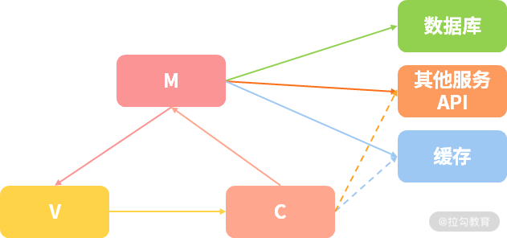
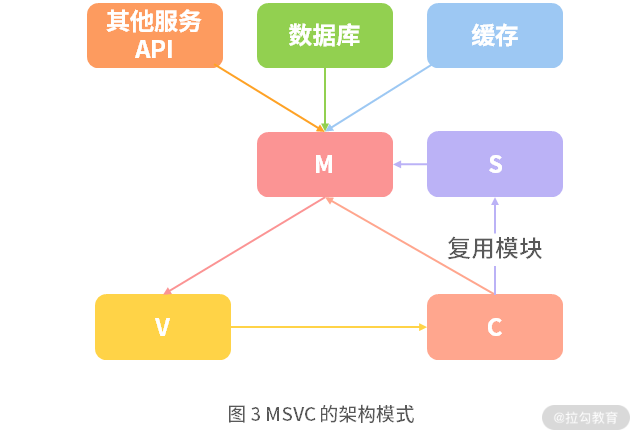

# RESTful 服务





## 获取用户发帖的列表信息  实现

API 列表的内容包含两部分，一部分是从数据库获取的发帖内容，但是这部分只包含用户 ID，另外一部分则是需要通过 ID 批量拉取用户信息。

RESTful API：

1. 由于是拉取列表内容接口，因此这里设计为一个 GET 接口，根据 RESTful 约束规则设计为：GET /v1/contents；
2. 另外还需要设计一个独立的服务用来获取用户信息，将接口设计为：GET /v1/userinfos。


1. 用户先调用 /v1/contents API 拉取 restful server 的内容
2. restful server 会首先去 MongoDB 中获取 contents；
3. 拿到 contents 后解析出其中的 userIds；
4. 然后再通过 /v1/userinfos API 调用 API server 的服务获取用户信息列表；
5. API server 同样需要和 MongoDB 交互查询到所需要的 userinfos；
6. 拿到 userinfos 后通过 addUserinfo 将用户信息整合到 contents 中去；
7. 最后将 contents 返回给到调用方。

### API server

```js
/**
 * 
 * 创建 http 服务，简单返回
 */

const server = http.createServer(async (req, res) => {

    // 获取 get 参数

    const pathname = url.parse(req.url).pathname;

    paramStr = url.parse(req.url).query,

    param = querystring.parse(paramStr);

    // 过滤非拉取用户信息请求

    if('/v1/userinfos' != pathname) {

      return setResInfo(res, false, 'path not found');

    }

    // 参数校验，没有包含参数时返回错误

    if(!param || !param['user_ids']) {

      return setResInfo(res, false, 'params error');

    }

});

```

#### restful server

```js
const server = http.createServer(async (req, res) => {

    // 获取 get 参数

    const pathname = url.parse(req.url).pathname;

    paramStr = url.parse(req.url).query,

    param = querystring.parse(paramStr);

    // 过滤非拉取用户信息请求

    if('/v1/contents' != pathname) {

      return setResInfo(res, false, 'path not found', null, '404');

    }

    // 从 db 查询数据，并获取，有可能返回空数据

    let contents = await queryData({}, {limit: 10});

    contents = await filterUserinfo(contents);

    return setResInfo(res, true, 'success', contents);

});

```

#### MVC


#### MVSC


